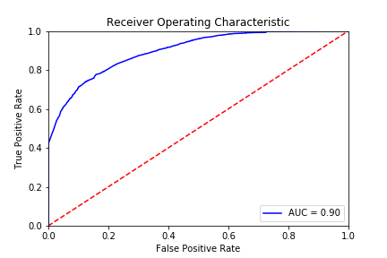

## Cancellation Prediction

The aim of this project is to predict bookings that will be canceled. 

It consists of two steps: **preprocessing** and **modelling**

### Accuracy Metrics

Some metrics are as follows for files:

<table class="tg">
  <tr>
    <th class="tg-cly1">File</th>
    <th class="tg-cly1">Algorithm</th>
    <th class="tg-cly1">Accuracy (CV=10)</th>
    <th class="tg-cly1">Precision</th>
    <th class="tg-cly1">Recall</th>
    <th class="tg-0lax">F1 Score</th>
    <th class="tg-cly1">AUC</th>
  </tr>
  <tr>
    <td class="tg-cly1" rowspan="4">H1</td>
    <td class="tg-cly1">Random Forests</td>
    <td class="tg-cly1">0.8591</td>
    <td class="tg-cly1">0.87</td>
    <td class="tg-cly1">0.87</td>
    <td class="tg-0lax">0.88</td>
    <td class="tg-cly1">0.95</td>
  </tr>
  <tr>
    <td class="tg-cly1">GBM</td>
    <td class="tg-cly1">0.8539</td>
    <td class="tg-cly1">0.87</td>
    <td class="tg-cly1">0.90</td>
    <td class="tg-0lax">0.88</td>
    <td class="tg-cly1">0.96</td>
  </tr>
  <tr>
    <td class="tg-cly1">XGB</td>
    <td class="tg-cly1">0.8533</td>
    <td class="tg-cly1">0.86</td>
    <td class="tg-cly1">0.90</td>
    <td class="tg-0lax">0.88</td>
    <td class="tg-cly1">0.95</td>
  </tr>
  <tr>
    <td class="tg-cly1">Light GBM</td>
    <td class="tg-cly1">0.8528</td>
    <td class="tg-cly1">0.82</td>
    <td class="tg-cly1">0.91</td>
    <td class="tg-0lax">0.86</td>
    <td class="tg-cly1">0.93</td>
  </tr>
  <tr>
    <td class="tg-baqh" rowspan="4">H2</td>
    <td class="tg-0lax">Random Forests</td>
    <td class="tg-0lax">0.8545</td>
    <td class="tg-0lax">0.90</td>
    <td class="tg-0lax">0.73</td>
    <td class="tg-0lax">0.80</td>
    <td class="tg-0lax">0.94</td>
  </tr>
  <tr>
    <td class="tg-0lax">GBM</td>
    <td class="tg-0lax">0.8815</td>
    <td class="tg-0lax">0.88</td>
    <td class="tg-0lax">0.83</td>
    <td class="tg-0lax">0.85</td>
    <td class="tg-0lax">0.95</td>
  </tr>
  <tr>
    <td class="tg-0lax">XGB</td>
    <td class="tg-0lax">0.8637</td>
    <td class="tg-0lax">0.87</td>
    <td class="tg-0lax">0.79</td>
    <td class="tg-0lax">0.83</td>
    <td class="tg-0lax">0.94</td>
  </tr>
  <tr>
    <td class="tg-0lax">Light GBM</td>
    <td class="tg-0lax">0.8111</td>
    <td class="tg-0lax">0.86</td>
    <td class="tg-0lax">0.65</td>
    <td class="tg-0lax">0.74</td>
    <td class="tg-0lax">0.90</td>
  </tr>
</table>

### Roc-Curve

The comparison between the prediction models as follows:

<table class="tg">
  <tr>
    <th class="tg-cly1"></th>
    <th class="tg-cly1">Random Forests</th>
    <th class="tg-cly1">GBM</th>
    <th class="tg-cly1">XGB</th>
    <th class="tg-cly1">Light GBM</th>
  </tr>
  <tr>
    <td class="tg-cly1">H1</td>
    <td class="tg-cly1"></td>
    <td class="tg-cly1"></td>
    <td class="tg-cly1"></td>
    <td class="tg-cly1"></td>
  </tr>
  <tr>
    <td class="tg-baqh">H2</td>
    <td class="tg-0lax"></td>
    <td class="tg-0lax"></td>
    <td class="tg-0lax"></td>
    <td class="tg-0lax"></td>
  </tr>
</table>